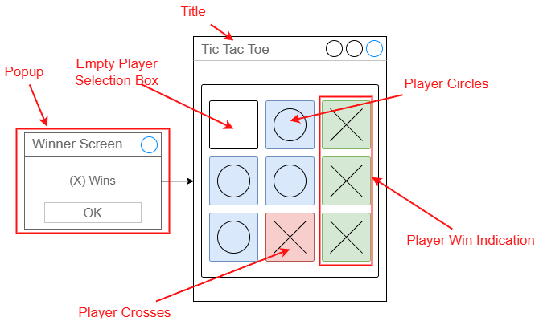
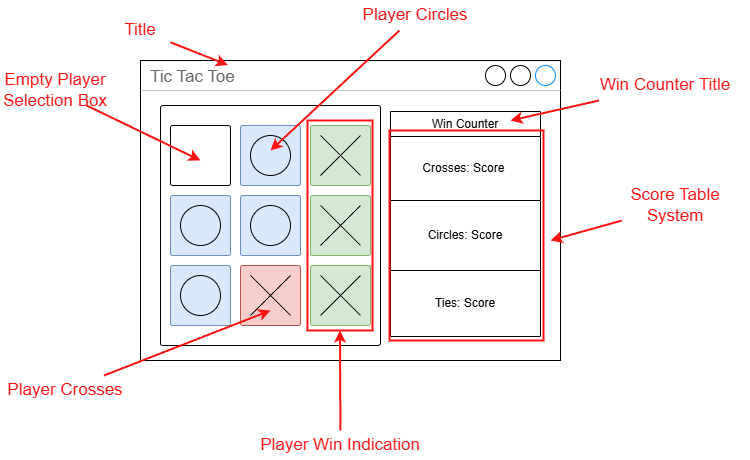
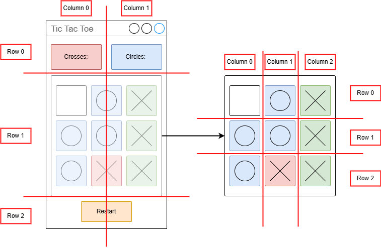

# 🗺️ Planning Notes

## 💭 Design Concepts

### Structure

For this tkinter programme I intend to make three applications to brainstorm ideas on what my potential digital outcome may look like and function for the intended end-user.

The aim of these designs must follow under the criteria of having the generic tic tac toe game loop as well the ability to keep track of winning and losing conditions through score labels, pop-ups etc.

#### 1️⃣ Concept One

In my first concept idea I decided to make a window where the main game will be located. This will be accompanied with the popup to showcase the winner of the current round and therefore give a visual indicator on th final victor. The game usage is the same being generic tic tac toe with the aim trying to get a 3 in the row win condition either horizontal, vertical or even diagonal.

#### 2️⃣ Concept Two

In my second concept I decided to add recorded visual indicators being labels to demonstrate the win amounts of each condition being: crosses, circles and tie winning probabilities. Therefore it shows the amount of times that the player has won rather than demonstrating it in a quick time popup.

#### 3️⃣ Concept Three

In my third design I decided to add a restart button alongside rearranged win counters at the top of the window rather than the side. These visual indicators seem more robust and clean to the other concept 2 design that had the win counter on the right side. The restart button allows for endless replayability allowing players to restart the game from the beginning erasing all the current player moves made.

#### 🏁 Final Design

For my final design, I decided to use stakeholder feedback to further enhance the playability of my programme and making it tailored for the specific needs of my targeted audience.

* 1️⃣ Stakeholder One (Opeloge)

Although they had requested that I modify the use of colour in my player opposition, I have decided not to do this since their method of making the colours similar in soft colours does not make meet the intended aesthetic of showing contrast between the two colours. Making it orange seems too close of a soft colour to light blue therefore my reasoning for neglecting this proposition.

* 2️⃣ Stakeholder Two (Astyn)

Stakeholder two had just commented that my design was very standard and minimalistic therefore no change required among their part.

* 3️⃣ Stakeholder Three (Zane)

Stakeholder three requested that in my second design to make the widgets smaller therefore I inherited the design features of the third design to make things minimalistic and coherent in their small sizes, making bigger more important aspects increased in size (the main game board).

## ⚙️ Functionality

In terms of functionality, my game programme for this current prototype is intended to allow players to try to achieve a 3 in a row line with the respective crosses or circles to therefore record those scores in the titles above.